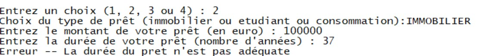

# Introduction

Lors de ce TP3, nous avons réalisé le développement d’un système-expert d’ordre 0+ de sa phase d’expertise à sa phase d’utilisation.
Pour cela, nous avons tout d'abord réfléchi à différents sujets possibles. Nous avions plusieurs idées telles que : des systèmes d'aides à la décision pour le choix d'une voiture en fonction du profil du client et de ses besoins, un outil d'aide à la réalisation de prêts bancaires, un outil pour accorder son vin avec son plat, un outil pour le choix des UVs ou encore la reconnaissance de plante en fonctions de leurs caractéristiques. Suite à plusieurs réflexions et mises en commun, nous avons décidé de choisir l'aide à la réalisation de prêts bancaires. En effet, ce sujet nous semblait le plus approprié et intéressant car il constitue un sujet concret. De plus, en tant qu’étudiant, on peut avoir à réaliser un prêt étudiant, et dans notre vie future nous seront sûrement amener à faire des prêts pour l'achat d'une voiture ou d'une maison par exemple. Lors d’un prêt étudiant, ce qui nous intéresse est le montant que l’on aura à rembourser par mois une fois que l’on sera diplômé, une partie de notre futur salaire sera dédiée au remboursement du prêt et il est important de savoir à quelle hauteur il s’élèvera.  
Il est souvent compliqué de savoir si l’on est éligible à tel ou tel prêt. Ou encore de savoir si nos revenus sont suffisants pour supporter le remboursement d’un prêt sur le long terme.  
L’interface finale de notre projet a pour objectif de clarifier ce type de questions. Elle est dédiée à tout particulier souhaitant réaliser un prêt, pas seulement pour le personnel bancaire.  

Ce choix nous permettait aussi d'appliquer des chaînages avant et arrière vus dans le cadre de ce cours.  

L'objectif de notre système-expert est de répondre à 3 problématiques majeurs :   
1. Un prêt est-il faisable ?  
2. Quel sera le montant à rembourser chaque mois ?  
3. Quelle sera la durée du prêt ?  

Pour répondre à la première question, nous allons demander à l'utilisateur toutes les informations nécessaires et effectuer des chaînages avant et arrière pour voir si un prêt est envisageable selon les critères précédemment renseignés.  
Pour les deux autres questions, nous calculons d'abord les valeurs voulues, puis vérifions si celles-ci entrent dans les critères de la base de règle grâce à un chaînage avant.  

Afin de mener à bien ce projet, nous nous sommes documentés sur les différentes possibilités de prêts et leurs conditions respectives.  
Cette recherche documentaire nous a permis de déterminer les connaissances nécessaires au système-expert et de créer notre base de règle associée.  

# Explication de la base de règles

Durant ce projet, nous avons décidé de traiter trois prêts majeurs, qui sont :  
- le prêt immobilier  
- le prêt étudiant  
- le prêt à la consommation  

La source experte provient de nombreux sites internet, que ce soit des banques ou des simulateurs préexistants. Les différents sites consultés sont référencés dans les sources.  
A partir de cette source d’expertise, nous avons pu créer notre base de règles. La bdr regroupe, pour chaque type de prêt, les caractéristiques permettant sa réalisation ainsi que tous les attributs qui le concerne :  
- taux  
- montant min  
- montant max  
- durée min   
- durée max  

Explication des termes utilisés :
- Endettement qui représente le taux d’endettement. Ce taux détermine le montant qu’un emprunteur peut raisonnablement consacrer au remboursement d’un crédit tout en continuant à vivre correctement. On le calcule de la manière suivante : endettement=  (mensualités ×100)/(revenus mensuels)
- Critère apport qui est un indicateur sur l’apport fournit par l’utilisateur. On considère que l’apport est suffisamment important lorsqu’il permet de couvrir les frais de dossier soit environ 10% du montant du prêt. Ainsi ce critère est placé à 1 s’il représente au moins 10% du montant et à 0 sinon.

Au final pour avoir un prêt immobilier accepté il faut que la personne soit de nationalité française ou ait vécu en France depuis au moins 5 ans, qu’elle ait une situation stable c’est-à-dire un CDI, être fonctionnaire ou avoir des revenus suffisamment élevés, que son taux d’endettement soit inférieur à 35%, que son critère de l’apport soit supérieur ou égal à 1, que la durée de son prêt soit comprise entre 7 et 25 et que le montant soit supérieur à 50000€.

Pour que le prêt soit refusé il faut que la personne soit âgée de plus de 65 et qu’elle n’ait souscrit à aucune assurance. 

Pour les prêts à la consommation on demande le type parmi travaux, auto et personnel car les taux changent en fonction du type sélectionné. 

## Base de règles

Voici la base de règles que nous avons mise en place pour la réalisation de ce projet :  
```lisp

(setq *bdr*

'(( R1 ((eq profession CDI)) (eq situation stable))
( R2 ((eq profession fonctionnaire)) (eq situation stable))
( R3 ((>= revenu 5000)) (eq situation stable))

( R4 ((eq nationalite France)(>= age 18)) (eq statut Francais))
( R5 ((eq lieuResidence France) (>= duree_sejour 5) (>= age 18)) (eq statut Francais))

( R6 ((eq profession etudiant) (eq statut Francais) (<= age 28)) (eq StatutEtu valide))

( R7 ((> age 65) (> duree_pret 7)) (eq etatPret refuse))
( R8 ((> age 65) (eq assurance non)) (eq etatPret refuse))

( R9 ((eq situation stable)(< endettement 35)) (eq typePret credit))

( R10 ((>= critereApport 1) (eq typePret credit) (eq statut Francais)) 
        (eq typePret Immobilier) )
( R11 ((eq typePret Immobilier)(<= duree_pret 27) (>= duree_pret 5) (>= montant 50000)) 
        (eq etatPret accepte))

( R12 ((eq typePret Immobilier)) (>= montant 50000))
( R13 ((eq typePret Immobilier)) (<= duree_pret 27))
( R14 ((eq typePret Immobilier)) (>= duree_pret 5))
( R15 ((eq typePret Immobilier) (<= duree_pret 10)) (= taux 2.40))
( R16 ((eq typePret Immobilier) (<= duree_pret 15)(> duree_pret 10)) (= taux 2.53))
( R17 ((eq typePret Immobilier) (<= duree_pret 20)(> duree_pret 15)) (= taux 2.64))
( R18 ((eq typePret Immobilier) (>= duree_pret 20)) (= taux 2.81))

( R19 ((eq statutEtu valide)) (eq typePret Etudiant))
( R20 ((eq typePret Etudiant) (>= montant 1500) (<= montant 30000) 
(>= duree_pret 2) (<= duree_pret 10)) (eq etatPret accepte))

( R21 ((eq typePret Etudiant)) (<= montant 30000))
( R22 ((eq typePret Etudiant)) (>= montant 1500))
( R23 ((eq typePret Etudiant)) (= taux 2.00))
( R24 ((eq typePret Etudiant)) (<= duree_pret 10))
( R25 ((eq typePret Etudiant)) (>= duree_pret 2))

( R26 ((eq typePret credit)(eq statut Francais)) (eq typePret consommation))
( R27 ((eq typePret consommation)(< montant 50000)(>= duree_pret 1)(<= duree_pret 6)) 
        (eq etatPret accepte))
( R28 ((eq typePret consommation)) (<= duree_pret 6))
( R29 ((eq typePret consommation)) (>= duree_pret 1))
( R30 ((eq typePret consommation)) (< montant 50000))

( R31 ((eq typePret consommation)(eq typeConso auto)(= duree_pret 1)) 
    (= taux 0.51))
( R32 ((eq typePret consommation)(eq typeConso auto)(<= duree_pret 2)(> duree_pret 1)) 
    (= taux 1.51))
( R33 ((eq typePret consommation)(eq typeConso auto)(<= duree_pret 3)(> duree_pret 2)) 
    (= taux 1.91))
( R34 ((eq typePret consommation)(eq typeConso auto)(<= duree_pret 5)(> duree_pret 3)) 
    (= taux 2.41))
( R35 ((eq typePret consommation)(eq typeConso auto)(<= duree_pret 6)(> duree_pret 5)) 
    (= taux 3.41))

( R36 ((eq typePret consommation)(eq typeConso travaux)(= duree_pret 1)) (= taux 0.91))
( R37 ((eq typePret consommation)(eq typeConso travaux)(<= duree_pret 2)(> duree_pret 1)) 
    (= taux 2.01))
( R38 ((eq typePret consommation)(eq typeConso travaux)(<= duree_pret 3)(> duree_pret 2)) 
    (= taux 2.41))
( R39 ((eq typePret consommation)(eq typeConso travaux)(<= duree_pret 4)(> duree_pret 3)) 
    (= taux 2.80))
( R40 ((eq typePret consommation)(eq typeConso travaux)(<= duree_pret 5)(> duree_pret 4)) 
    (= taux 3.00))
( R41 ((eq typePret consommation)(eq typeConso travaux)(<= duree_pret 6)(> duree_pret 5)) 
    (= taux 3.40))

( R42 ((eq typePret consommation)(eq typeConso personnel)(= duree_pret 1)) (= taux 0.51))
( R43 ((eq typePret consommation)(eq typeConso personnel)(<= duree_pret 2)(> duree_pret 1)) 
    (= taux 1.51))
( R44 ((eq typePret consommation)(eq typeConso personnel)(<= duree_pret 3)(> duree_pret 2)) 
    (= taux 1.91))
( R45 ((eq typePret consommation)(eq typeConso personnel)(<= duree_pret 4)(> duree_pret 3)) 
    (= taux 2.80))
( R46 ((eq typePret consommation)(eq typeConso personnel)(<= duree_pret 5)(> duree_pret 4)) 
    (= taux 2.41))
( R47 ((eq typePret consommation)(eq typeConso personnel)(<= duree_pret 6)(> duree_pret 5)) 
    (= taux 4.51))
))

```

## Arbre de déduction

Voici l'arbre de déduction correspondant à la base de règles ci-dessus :  

Le premier arbre permet de représenter toutes les règles jusqu'à R25 et le second permet de représenter les règles suivantes (elles sont principalement liées au prêt à la consommation).  

\includepdf[width=17cm, page=1]{img/Arbre_TP3.pdf}
\includepdf[width=17cm, page=2]{img/Arbre_TP3.pdf}

## Sources

Les sources suivantes nous ont permis d'élaborer notre base de règles :  

Pour le prêt immobilier : 
https://edito.seloger.com/conseils-d-experts/acheter/les-conditions-d-obtention-d-un-pret-immobilier-book.html 
https://www.pretto.fr/pret-immobilier/conditions-credit-immobilier/
Pour le prêt étudiant :
	https://www.banquepopulaire.fr/conseils/conditions-pret-etudiant/
Pour le crédit à la consommation :
	https://www.nos-economies.fr/credit-consommation/conditions-obtention-credit-conso/
	https://www.nos-economies.fr/credit-consommation/comparateur-credit-conso/ 


# Implémentation

## Explication des moteurs d'inférences choisis

Avec cette bdr nous avons décidé de réaliser un menu proposant 3 choix afin de répondre aux trois problématiques mentionnées dans l'introduction.  

Le premier étant pour tester la faisabilité du prêt :  
    Dans la fonction fpret, on réalise un chaînage arrière afin de savoir si les informations rentrées par l’utilisateur permettent d’arriver à la conclusion (eq etatPret accepte). Ce chaînage arrière s’effectue en profondeur sur la bdr puisqu’il parcourt les règles comportant la conclusion (eq typePret credit) (eq situation stable) (eq typePret ‘immobilier ou ‘etudiant ou ‘consommation) et (eq statut français). Avant de réaliser ce chaînage arrière, on effectue un autre chaînage arrière sur la conclusion (eq etatPret refuse) pour vérifier si l’utilisateur n’a pas entré d’informations qui pouvaient compromettre son prêt, notamment un âge avancé.  
Ensuite, le menu propose le calcul de la mensualité :  
    La fonction calculmensualité permet pour un type de prêt donné et une durée de récupérer à l’aide d’un chaînage avant le taux correspondant afin de calculer le montant que l’emprunteur aura à rembourser chaque mois. A noter que cette fonction est utilisée dans la première partie du menu également. 
Ce calcul s’effectue de la manière suivante :
    (montant ×(1+taux/100))/(durée ×12)
Enfin, la troisième proposition permet de fournir une durée pour le remboursement d’un prêt :  
    La fonction duree_remboursement calcule la durée nécessaire de remboursement d’un prêt à l’aide d’un montant et d’un critère de mensualité donné. Ce critère de mensualité définit le montant que l’emprunteur souhaite rembourser par mois.  
    Remarque : pour pouvoir connaitre le taux à appliquer nous avons besoin de la durée du prêt, or dans ce cas elle nous est inconnue. Le chainage avant pour trouver le taux selon le type de pret nous renvoie le taux le plus élevé (cela s'explique par le fait que la base de fait s'enrichit du maximum de la durée possible en tant que durée_pret). Alors, suite au calcul, on obtient une durée ne correspondant pas parfaitement au taux choisi. Pour palier à cette différence, nous réeffectuons un chainage avant mais cette fois ci en entrant dans la base de fait la durée de pret qui vient d'être trouvée, le taux retourné se rapproche alors davantage de la réalité. Ainsi, suite à un deuxième calcul, on retrouve une deuxième durée (sensiblement identique si le montant n'est pas très élevé) qu'on renvoie. Suite à ce deuxième calcul, il se pourrait que le deuxième taux ne corresponde toujours par à la durée trouvée, cependant nous avons décidé de ne pas continuer cette boucle car nous considérons que le résultat changerait extrêment peu par la suite (les taux sont généralement autour de 2% et on remarque de faible variations).  

D’autres fonctions annexes sont employées dans ces fonctions.  

On retrouve notamment les getters qui permettent de demander à l'utilisateur les informations nécessaires afin de remplir la base de fait à l’aide d’un read pour chaque type de donnée voulue.  

Les checkers vérifient à l’aide d’un chaînage avant si le montant (respectivement la durée) correspond bien au minimum et au maximum de chaque type de prêt.  

Le chaînage arrière est réalisé grâce à la combinaison de la fonction verfier_ou et vérifier_et. Verifier_ou permet de vérifier si la bdf permet de vérifier au moins une règle comportant le but voulu. Elle fait appel (à chaque « ou ») à vérifier_et qui vérifie pour chaque règle si la bdf vérifie toutes les prémisses de la règle.  
Pour des fins d’explicabilité, nous avons modifié la fonction vérifier_et et ajouté une variable globale dernier_enr qui nous permet d'enregistrer la règle qui n’a pas abouti au succès du chaînage avant. De ce fait, dans la fonction fpret, un affichage permet d’indiquer pourquoi le prêt n’est pas faisable. Cela permet d'informer l’utilisateur, qui sait alors quel critère ne correspond pas afin de pouvoir le modifier si possible.  

Le chaînage avant parcourt toute la bdr, si une règle se vérifie avec la bdf grâce à la fonction verif_regle alors quand le premier parcours de la bdr sera fini, il faudra recommencer puisque la bdf sera enrichie. Lorsqu’une conclusion comportant le terme recherché est atteinte, on ajoute la conclusion à une liste résultat qui sera renvoyée à la fin de l’exécution de la fonction.  
Lors de l'enrichissement de la bdf, on vérifie que la caractéristique n'y est pas déjà présente. Pour les conclusions qui contiennent de >= ou <= nous avons décidé de les traiter comme s'il s'agissait d'un = puisque cela n'affecte pas nos traitements par la suite.  
Par exemple, si on veut récupérer la durée min et max d’un prêt étudiant la liste résultat contiendra : ((>= duree_pret 2)(<= duree_pret 10)). Ainsi, il ne reste plus qu’à vérifier si la durée entrée par l’utilisateur est comprise entre ces deux durées, c’est notamment sur ce principe que fonctionnent les checkers.  

## Explication des résultats obtenus

Pour le bon fonctionnement de notre système-expert, nous avons tout d'abord mis en place un menu afin de faciliter l'utilisation. Ce menu est composé de quatre options disponibles et permet de demander à l'utilisateur quel est son choix. (Ce menu peut être obtenu par l'appel de la fonction (menubanque))  


La première fonctionnalité permet de tester la faisabilité d'un prêt.  


Dans ces deux exemples, on remarque qu'il est demandé à l'utilisateur toutes les informations nécessaires au remplissage de la base de fait qui servira par la suite pour le traitement des informations dans la fonction fpret. On remarque que dans ces deux exemples les prêts peuvent être envisageables, car les critères entrés sont corrects et correspondent à la base de règle.  

Nous avons ensuite deux exemples pour lesquels le prêt est impossible :  


La figure 4 montre un prêt impossible dû à l'âge. En effet, l'utilisateur a entré un âge de 80 ans sans assurance. Or, par la règle 8, on remarque qu'il est impossible de contracter un prêt pour une personne ayant plus de 65 ans et ne souscrivant pas à une assurance.  
Dans la figure 5, on remarque que le prêt est refusé, car le taux d'endettement est trop élevé. En effet, celui-ci ne doit pas dépasser 35 %.  

Enfin, la troisième fonctionnalité permet de calculer la durée d'un prêt.


Dans cet exemple, l'utilisateur cherche à rembourser un prêt de 99 500€ avec une mensualité de 1 215€. Le moteur permet de définir la durée de remboursement avec ces paramètres. Il nous renvoie qu’avec cette mensualité, le prêt peut être remboursé en 7 ans. 


 Enfin, ce dernier exemple, renvoie une erreur, car il est impossible de rembourser un prêt de 200 000€ avec des mensualités de 600€.

Ensuite, la seconde fonctionnalité permet de calculer les mensualités d'un prêt.


Dans cet exemple, l'utilisateur cherche à rembourser un prêt de 99 500€ en 26 ans. Le moteur permet de définir que cet utilisateur devra rembourser environ 327.87€ par mois.  


Dans ce second exemple, on remarque que le moteur ne calcule pas la mensualité demandée par l'utilisateur. En effet, la durée du prêt n'est pas adéquate pour le remboursement. Cette erreur peut être due à deux facteurs : le premier est une durée de prêt trop longue et le second est une durée trop courte pour permettre le remboursement. Dans notre cas, ce prêt est refusé, car la durée du prêt est trop longue.   

# Conclusion

Pour conclure, ce TP a été très instructif. Il nous a permis de mettre en place un système-expert d’ordre 0+ de sa phase d’expertise à sa phase d’utilisation.  
Nous avons tout d'abord fait des recherches sur le domaine d'expertise de notre système. Ensuite, nous avons formalisé la base de règles afin que celle-ci soit utilisable par notre système et enfin nous avons réalisé un ensemble de fonctions outils, de moteurs d'inférence ainsi qu'une fonction principale afin de permettre le bon fonctionnement de notre système.  

Concernant la répartition des tâches, elles ont été réparties équitablement tout au long de notre TP (comme dans les TPs précédents). Une bonne dynamique de travail est installée, nous nous sommes tous les deux investis dans les trois TPs.  

