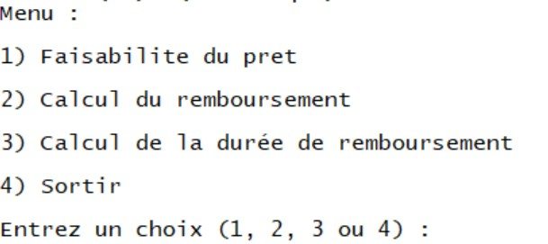
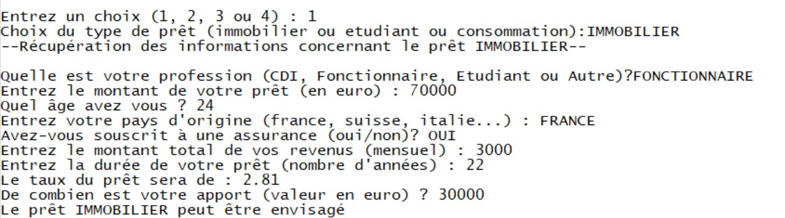
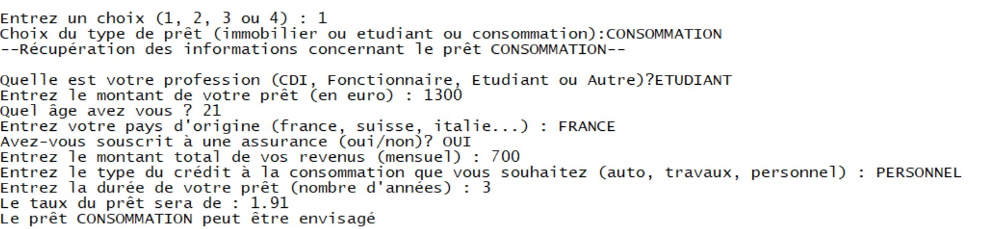
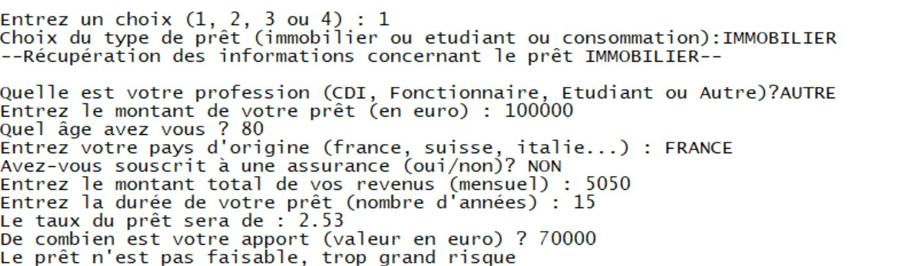
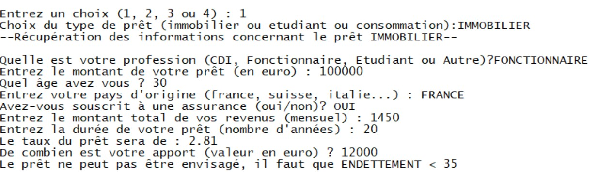
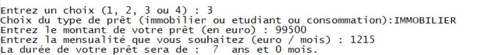
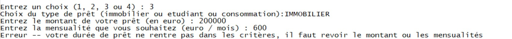
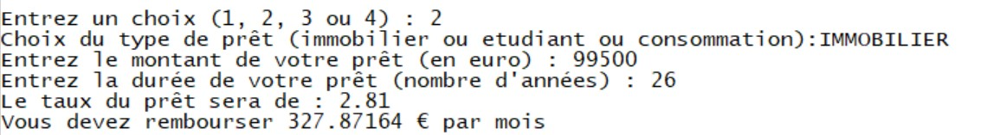
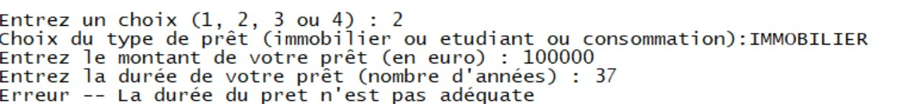

% Systeme Expert
% Tobias SAVARY | Camille BAUVAIS
% January 03, 2023

---
title: 
- Aide à la réalisation de prêts bancaires
author:
- Tobias SAVARY | Camille BAUVAIS
theme:
- Copenhagen
---


# Aide à la réalisation de prêts bancaires

## Problématique    
1. Un prêt est-il faisable ?
2. Quel sera le montant à rembourser chaque mois ?
3. Quelle sera la durée du prêt ?

## Sujet 

### Aide à la réalisation de prêts bancaires
- Faisabilité du prêt
- Montant du remboursement
- Durée du remboursement

### Types de prêt 
- le prêt immobilier
- le prêt étudiant 
- le crédit à la consommation 


## Source d'expertise

### Création de la base de règles

Recherche sur des sites de banques ou sur des simulateurs préexistants. 

**Prêt immobilier** : 

- edito.seloger.com  
- www.pretto.fr  

**Prêt étudiant** :  

- www.banquepopulaire.fr  

**Crédit à la consommation** :  

- www.nos-economies.fr  

## Source d'expertise

### Caractéristiques pour chaque type de prêt
- taux
- montant min
- montant max
- durée min 
- durée max


## Base de règles
```lisp
(setq *bdr*

'(( R1 ((eq profession CDI)) (eq situation stable))
( R2 ((eq profession fonctionnaire)) (eq situation stable))
( R3 ((>= revenu 5000)) (eq situation stable))
( R4 ((eq nationalite France)(>= age 18)) 
        (eq statut Francais))
( R5 ((eq lieuResidence France) (>= duree_sejour 5) 
    (>= age 18)) (eq statut Francais))
( R6 ((eq profession etudiant) (eq statut Francais) 
    (<= age 28)) (eq StatutEtu valide))
( R7 ((> age 65) (> duree_pret 7)) 
        (eq etatPret refuse))
( R8 ((> age 65) (eq assurance non)) (eq etatPret refuse))

```


## Base de règles

```lisp
( R9 ((eq situation stable)(< endettement 35)) 
        (eq typePret credit))
( R10 ((>= critereApport 1) (eq typePret credit) 
    (eq statut Francais)) (eq typePret Immobilier))
( R11 ((eq typePret Immobilier)(<= duree_pret 27) 
    (>= duree_pret 5) (>= montant 50000)) 
        (eq etatPret accepte))
( R12 ((eq typePret Immobilier)) (>= montant 50000))
( R13 ((eq typePret Immobilier)) (<= duree_pret 27))
( R14 ((eq typePret Immobilier)) (>= duree_pret 5))
( R15 ((eq typePret Immobilier) (<= duree_pret 10)) 
        (= taux 2.40))
( R16 ((eq typePret Immobilier) (<= duree_pret 15)
        (> duree_pret 10)) (= taux 2.53))
( R17 ((eq typePret Immobilier) (<= duree_pret 20)
        (> duree_pret 15)) (= taux 2.64))
```

## Base de règles
```lisp
( R18 ((eq typePret Immobilier) (>= duree_pret 20)) 
        (= taux 2.81))
( R19 ((eq statutEtu valide)) (eq typePret Etudiant))
( R20 ((eq typePret Etudiant) (>= montant 1500) 
   (<= montant 30000) (>= duree_pret 2) (<= duree_pret 10)) 
        (eq etatPret accepte))
( R21 ((eq typePret Etudiant)) (<= montant 30000))
( R22 ((eq typePret Etudiant)) (>= montant 1500))
( R23 ((eq typePret Etudiant)) (= taux 2.00))
( R24 ((eq typePret Etudiant)) (<= duree_pret 10))
( R25 ((eq typePret Etudiant)) (>= duree_pret 2))
( R26 ((eq typePret credit)(eq statut Francais)) 
    (eq typePret consommation))
```

## Base de règles
```lisp
( R27 ((eq typePret consommation)(< montant 50000)
    (>= duree_pret 1)(<= duree_pret 6))
     (eq etatPret accepte))
( R28 ((eq typePret consommation)) (<= duree_pret 6))
( R29 ((eq typePret consommation)) (>= duree_pret 1))
( R30 ((eq typePret consommation)) (< montant 50000))
( R31 ((eq typePret consommation)(eq typeConso auto)
        (= duree_pret 1)) (= taux 0.51))
( R32 ((eq typePret consommation)(eq typeConso auto)
        (<= duree_pret 2)(> duree_pret 1)) (= taux 1.51))
( R33 ((eq typePret consommation)(eq typeConso auto)
        (<= duree_pret 3)(> duree_pret 2)) (= taux 1.91))
( R34 ((eq typePret consommation)(eq typeConso auto)
        (<= duree_pret 5)(> duree_pret 3)) (= taux 2.41))
( R35 ((eq typePret consommation)(eq typeConso auto)
        (<= duree_pret 6)(> duree_pret 5)) (= taux 3.41))
```


## Base de règles
```lisp
( R36 ((eq typePret consommation)(eq typeConso travaux)
        (= duree_pret 1)) (= taux 0.91))
( R37 ((eq typePret consommation)(eq typeConso travaux)
        (<= duree_pret 2)(> duree_pret 1)) (= taux 2.01))
( R38 ((eq typePret consommation)(eq typeConso travaux)
        (<= duree_pret 3)(> duree_pret 2)) (= taux 2.41))
( R39 ((eq typePret consommation)(eq typeConso travaux)
        (<= duree_pret 4)(> duree_pret 3)) (= taux 2.80))
( R40 ((eq typePret consommation)(eq typeConso travaux)
        (<= duree_pret 5)(> duree_pret 4)) (= taux 3.00))
( R41 ((eq typePret consommation)(eq typeConso travaux)
        (<= duree_pret 6)(> duree_pret 5)) (= taux 3.40))
( R42 ((eq typePret consommation)(eq typeConso personnel)
        (= duree_pret 1)) (= taux 0.51))
```


## Base de règles

```lisp
( R43 ((eq typePret consommation)(eq typeConso personnel)
        (<= duree_pret 2)(> duree_pret 1)) (= taux 1.51))
( R44 ((eq typePret consommation)(eq typeConso personnel)
        (<= duree_pret 3)(> duree_pret 2)) (= taux 1.91))
( R45 ((eq typePret consommation)(eq typeConso personnel)
        (<= duree_pret 4)(> duree_pret 3)) (= taux 2.80))
( R46 ((eq typePret consommation)(eq typeConso personnel)
        (<= duree_pret 5)(> duree_pret 4)) (= taux 2.41))
( R47 ((eq typePret consommation)(eq typeConso personnel)
        (<= duree_pret 6)(> duree_pret 5)) (= taux 4.51))
))

```


## Moteurs utilisés

### Faisabilité du prêt

- Chaînage arrière en profondeur avec (eq etatPret refuse)
- Chaînage arrière en profondeur avec (eq etatPret accepte)

### Montant du remboursement

- chaînage avant (récupération du taux)
- Calcul interne

### Durée du remboursement

- Calcul interne

## Démo pour fpret

Pierre  
24 ans, Français  
Métier : ingénieur (CDI)  
Revenus : 3000/Mois  

Veut faire un prêt immobilier de 70 000€ en 22 ans.  
Il dispose d'une assurance et de 30 000€ d'apport. 

## Démo pour calculmensualité

Julie  
19 ans, Française  
Etudiante   

Elle souhaite emprunter 10 000€ pour une durée de 7 ans.    
Elle se demande quel est le montant qu'elle aura à rembourser chaque mois.  

## Démo pour dureepret

Philippe veut faire un crédit à la consommation afin de rénover sa cuisine.  
Il souhaite emprunter 5 000€ tout en remboursant seulement 250€ par mois.  
Quelle doit-être la durée de son prêt ?  
<!-- ### Menu



## Exemple d'execution
### Faisabilité d'un prêt



## Exemple d'execution
### Faisabilité d'un prêt



## Exemple d'execution
### Faisabilité d'un prêt



## Exemple d'execution
### Faisabilité d'un prêt



## Exemple d'execution
### Calcul mensualité



## Exemple d'execution
### Calcul mensualité



## Exemple d'execution
### Calcul durée



## Exemple d'execution
### Calcul durée
 -->

## Conclusion 

**Aide à la réalisation de prêts bancaires**

### Moteurs
- Chainage avant
- Chainage arrière

### Fonctionnalités
- Faisabilité du prêt
- Montant du remboursement
- Durée du remboursement

## Merci


<!-- Pour compiler :
pandoc -t beamer slides.md -o slides.pdf -->
